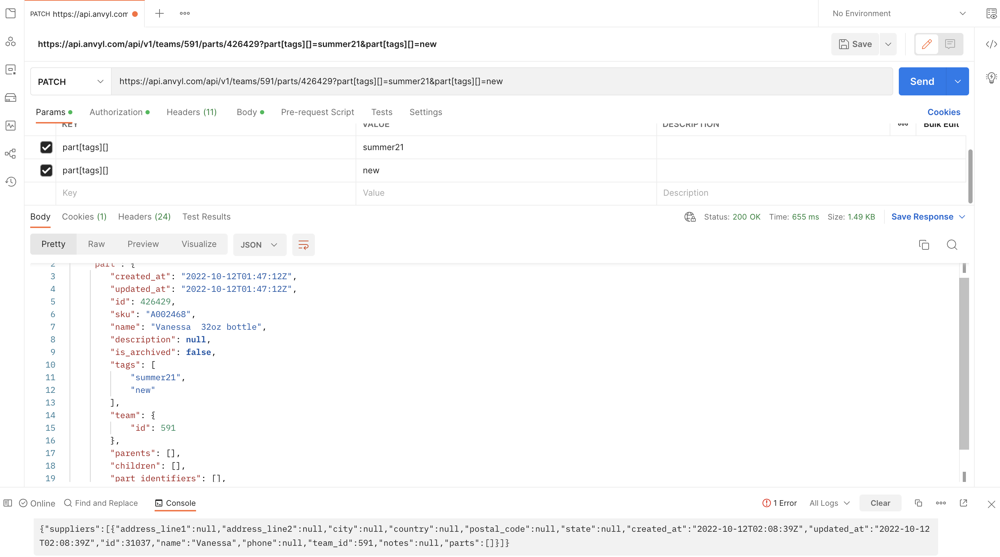
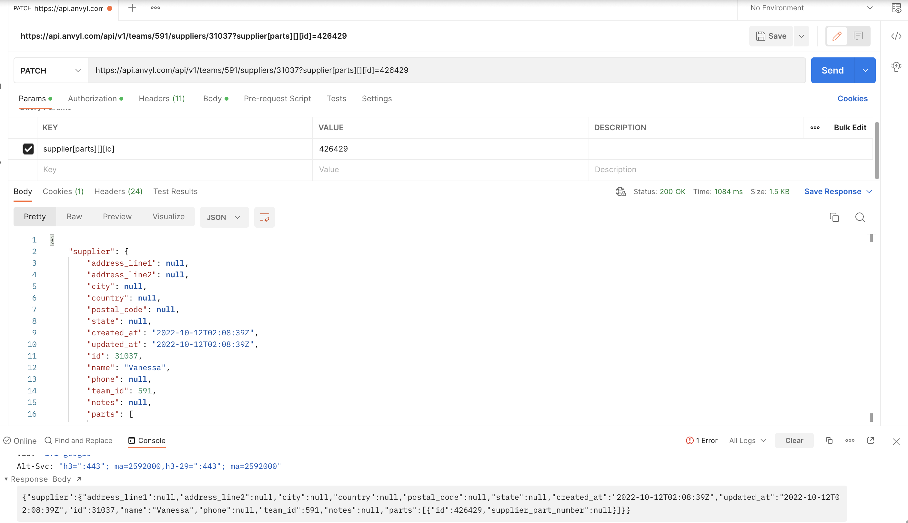

# Anvyl Integration Solutions Engineer Technical Exercise

#### 1) Anvyl allows you to create suppliers via API, please create a supplier called “[Your name]’s supplier” and provide us the supplier ID. 

Supplier ID: 31037

Endpoint: 
POST https://api.anvyl.com/api/v1/teams/591/suppliers?supplier[name]=Vanessa

#### 2) Anvyl also allows you to create parts via API, please create a part called “[Your Name]’s 32oz bottle” with SKU number = A002468. Provide us the part ID that you just created.

Part ID: 426429

Endpoint: 
POST https://api.anvyl.com/api/v1/teams/591/parts?part[sku]=A002468&part[name]=Vanessa  32oz bottle

#### 3) Can you add in two tags (summer21, new) for the part and connect the part to the supplier you just created?

Endpoints:
PATCH https://api.anvyl.com/api/v1/teams/591/parts/426429?part[tags][]=summer21&part[tags][]=new

PATCH https://api.anvyl.com/api/v1/teams/591/suppliers/31037?supplier[parts][][id]=426429

#### 4) A new startup that focuses on making different water bottles would like to issue a purchase order for the 32oz bottle that you just created. They’d like to order 20,000 bottles at $0.80/bottle price point, can you create and issue a purchase order via API for them? What’s the PO ID? 

PO ID: 88068

Endpoint: 
https://api.anvyl.com/api/v1/teams/591/purchase_orders?purchase_order[order_items][][part_id]=426429&purchase_order[supplier][id]=31037&purchase_order[order_items][][quantity]=20000&purchase_order[order_items][][unit_price_micros]=0.80&purchase_order[currency]=USD&purchase_order[order_items][][unit_of_measure]=unit&purchase_order[ships_on]=2022-10-13

#### 5) After issuing the purchase order, there is a supply chain crisis so you have to increase the price for these bottles to $1.2/bottle. Can you update the price in the purchase order? 